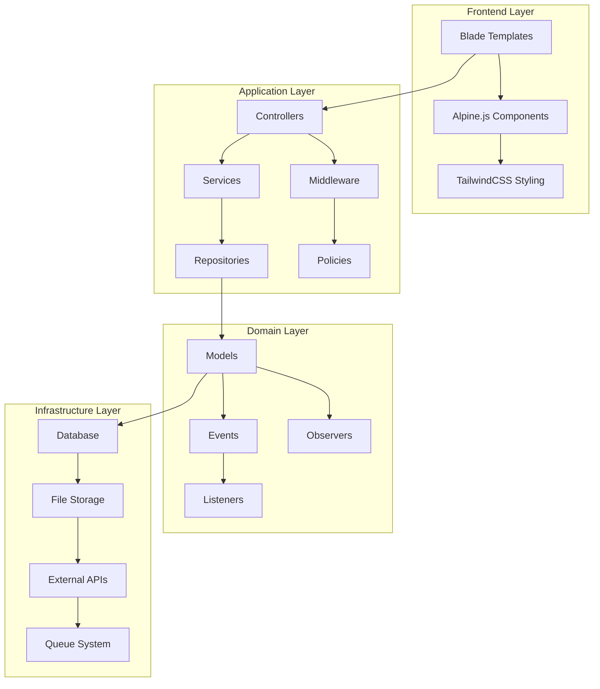
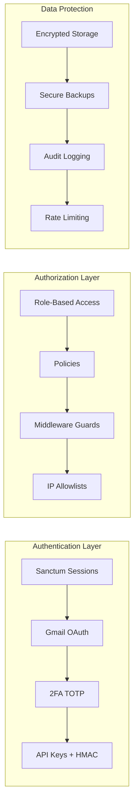
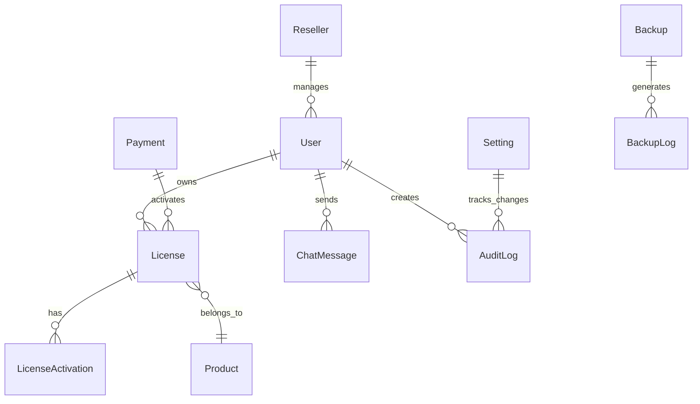
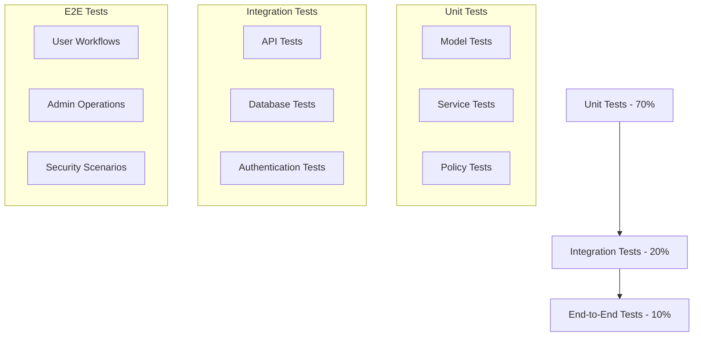

# Design Document

## Overview

The Laravel License Management System is a comprehensive, security-focused application built on Laravel 11 that provides license management, multi-role authentication, operational tools, and system administration capabilities. The system follows a modular architecture with clear separation of concerns, implementing security best practices and operational excellence.

### Technology Stack
- **Backend**: Laravel 11 with PHP 8.2+
- **Frontend**: Blade templates, Alpine.js, TailwindCSS
- **Database**: MySQL/MariaDB with proper indexing
- **Authentication**: Laravel Sanctum + Laravel Socialite (Gmail OAuth)
- **Security**: 2FA (TOTP), API key management, encrypted storage
- **Deployment**: cPanel compatible with HTTPS support

### Key Design Principles
- Security-first approach with defense in depth
- Test-driven development with comprehensive coverage
- Modular architecture for maintainability
- Performance optimization with proper indexing and caching
- Operational excellence with monitoring and backup capabilities

## Architecture

### High-Level Architecture



### Security Architecture



## Components and Interfaces

### Authentication System

#### Multi-Provider Authentication
- **Primary**: Email/password with Argon2id hashing
- **Secondary**: Gmail OAuth via Laravel Socialite
- **Hybrid**: Gmail OAuth + optional extra password
- **Security**: Session regeneration, secure cookies, CSRF protection

#### Two-Factor Authentication
- **Implementation**: TOTP using `pragmarx/google2fa`
- **Scope**: Required for admin/developer sensitive operations
- **Backup**: Recovery codes stored encrypted
- **UI**: QR code generation and validation interface

#### Session Management
- **Driver**: Database-backed sessions for scalability
- **Security**: Absolute expiry, idle timeout, concurrent session detection
- **Features**: Force logout capability, session hijacking detection

### Role-Based Access Control (RBAC)

#### Role Hierarchy
```
Admin (Highest)
├── Full system access
├── User management
├── System settings
└── Backup/restore operations

Developer
├── Operational tools access
├── System monitoring
├── Backup operations
└── API key management

Reseller
├── License management (scoped)
├── User management (scoped)
└── Dashboard access

User (Lowest)
├── Profile management
├── License viewing
└── Chat access
```

#### Policy Implementation
- **Gate-based**: Laravel Gates for simple checks
- **Policy-based**: Eloquent Model Policies for complex authorization
- **Middleware**: Route-level protection with role verification
- **Blade**: Template-level permission checks

### License Management System

#### License Model Structure
```php
class License extends Model
{
    protected $fillable = [
        'product_id', 'owner_id', 'user_id', 'license_key',
        'status', 'device_type', 'max_devices', 'expires_at'
    ];
    
    protected $casts = [
        'expires_at' => 'datetime',
        'metadata' => 'json'
    ];
}
```

#### Device Binding System
- **Tracking**: Hardware fingerprinting with device_hash
- **Validation**: Cryptographic verification of device identity
- **Management**: Reset, suspend, and transfer capabilities
- **Limits**: Configurable maximum device count per license

#### API Validation Endpoint
- **Authentication**: JWT tokens or API key + HMAC signature
- **Rate Limiting**: Configurable per-client limits
- **Logging**: Comprehensive audit trail
- **Response**: Standardized JSON with validation status

### User Management and Profiles

#### User Model Extensions
```php
class User extends Authenticatable
{
    protected $fillable = [
        'name', 'email', 'password', 'avatar', 'role',
        '2fa_enabled', 'privacy_policy_accepted_at', 'developer_notes'
    ];
    
    protected $hidden = ['password', 'remember_token', '2fa_secret'];
    
    protected $casts = [
        'privacy_policy_accepted_at' => 'datetime',
        '2fa_enabled' => 'boolean'
    ];
}
```

#### Privacy Compliance (GDPR)
- **Consent Tracking**: Timestamped privacy policy acceptance
- **Data Export**: JSON export of all user data
- **Data Erasure**: Soft delete with anonymization option
- **Audit Trail**: Complete record of privacy-related actions

### Communication System

#### Real-time Chat Architecture
- **Transport**: AJAX polling (5-second intervals)
- **Fallback**: WebSocket support for future enhancement
- **Hierarchy**: User ↔ Reseller ↔ Admin communication paths
- **Features**: Message threading, file attachments, emoji support

#### Message Management
- **Storage**: Optimized database schema with indexing
- **Moderation**: Automated spam detection and manual review
- **Rate Limiting**: Per-user message frequency controls
- **Archival**: Automatic cleanup of old messages

### Payment Integration

#### Webhook Processing
- **Providers**: Stripe, PayPal, Razorpay support
- **Verification**: Signature validation for each provider
- **Idempotency**: Duplicate prevention with unique keys
- **Error Handling**: Retry logic with exponential backoff

#### Transaction Management
- **Atomic Operations**: Database transactions for consistency
- **Wallet System**: Credit-based license purchasing
- **Audit Trail**: Complete payment history tracking
- **Reconciliation**: Automated matching with external records

### Operational Tools

#### Backup System Architecture
```mermaid
graph LR
    A[Backup Trigger] --> B[Pre-flight Checks]
    B --> C[Database Dump]
    C --> D[File Collection]
    D --> E[Encryption (AES-256)]
    E --> F[Compression]
    F --> G[Offsite Storage]
    G --> H[Verification]
    H --> I[Cleanup]
```

#### Backup Components
- **Scheduler**: Cron-based automated backups
- **Manual Trigger**: On-demand backup initiation
- **Encryption**: AES-256 with configurable passphrase
- **Storage**: S3-compatible and FTP support
- **Verification**: Checksum validation and integrity checks

#### System Monitoring
- **Health Checks**: Disk space, database size, queue status
- **Performance Metrics**: Response times, error rates, throughput
- **Alerting**: Email/Telegram notifications for critical issues
- **Dashboard**: Real-time system status visualization

### Settings Management

#### Configuration Architecture
- **Hierarchical**: Environment → Database → User preferences
- **Encryption**: Sensitive values encrypted at rest
- **Validation**: Schema-based configuration validation
- **Audit**: Complete change history tracking

#### Settings Categories
1. **General**: Site title, domain, branding
2. **Email**: SMTP configuration with test functionality
3. **Storage**: S3/FTP settings with validation
4. **Integrations**: Telegram, payment providers
5. **DevOps**: Backup schedules, monitoring thresholds

## Data Models

### Core Entity Relationships



### Database Schema Design

#### Users Table
```sql
CREATE TABLE users (
    id BIGINT UNSIGNED PRIMARY KEY AUTO_INCREMENT,
    name VARCHAR(255) NOT NULL,
    email VARCHAR(255) UNIQUE NOT NULL,
    password VARCHAR(255) NULL,
    avatar VARCHAR(255) NULL,
    role ENUM('admin', 'developer', 'reseller', 'user') DEFAULT 'user',
    2fa_enabled BOOLEAN DEFAULT FALSE,
    2fa_secret VARCHAR(255) NULL,
    privacy_policy_accepted_at TIMESTAMP NULL,
    developer_notes TEXT NULL,
    reseller_id BIGINT UNSIGNED NULL,
    created_at TIMESTAMP DEFAULT CURRENT_TIMESTAMP,
    updated_at TIMESTAMP DEFAULT CURRENT_TIMESTAMP ON UPDATE CURRENT_TIMESTAMP,
    deleted_at TIMESTAMP NULL,
    INDEX idx_email (email),
    INDEX idx_role (role),
    INDEX idx_reseller (reseller_id)
);
```

#### Licenses Table
```sql
CREATE TABLE licenses (
    id BIGINT UNSIGNED PRIMARY KEY AUTO_INCREMENT,
    product_id BIGINT UNSIGNED NOT NULL,
    owner_id BIGINT UNSIGNED NOT NULL,
    user_id BIGINT UNSIGNED NULL,
    license_key VARCHAR(255) UNIQUE NOT NULL,
    status ENUM('active', 'expired', 'suspended', 'reset') DEFAULT 'active',
    device_type VARCHAR(100) NULL,
    max_devices INT DEFAULT 1,
    expires_at TIMESTAMP NULL,
    metadata JSON NULL,
    created_at TIMESTAMP DEFAULT CURRENT_TIMESTAMP,
    updated_at TIMESTAMP DEFAULT CURRENT_TIMESTAMP ON UPDATE CURRENT_TIMESTAMP,
    deleted_at TIMESTAMP NULL,
    INDEX idx_license_key (license_key),
    INDEX idx_owner (owner_id),
    INDEX idx_status (status),
    INDEX idx_expires (expires_at)
);
```

#### Performance Optimization
- **Indexing Strategy**: Composite indexes for common query patterns
- **Partitioning**: Time-based partitioning for audit logs
- **Caching**: Redis-based caching for frequently accessed data
- **Query Optimization**: Eager loading and query scoping

## Error Handling

### Exception Hierarchy
```php
namespace App\Exceptions;

class LicenseException extends Exception {}
class ValidationException extends LicenseException {}
class AuthenticationException extends LicenseException {}
class AuthorizationException extends LicenseException {}
class BackupException extends LicenseException {}
```

### Error Response Strategy
- **API Responses**: Standardized JSON error format
- **Web Responses**: User-friendly error pages with logging
- **Logging**: Structured logging with context information
- **Monitoring**: Integration with Sentry for error tracking

### Graceful Degradation
- **Service Unavailability**: Fallback mechanisms for external services
- **Database Issues**: Read-only mode with cached data
- **Storage Problems**: Local fallback for file operations
- **Network Failures**: Retry logic with circuit breakers

## Testing Strategy

### Test Pyramid Structure


### Test Categories

#### Security Testing
- **Authentication**: Login flows, 2FA validation, session management
- **Authorization**: Role-based access, policy enforcement
- **Input Validation**: SQL injection, XSS prevention, CSRF protection
- **Rate Limiting**: API throttling, brute force protection

#### Functional Testing
- **License Management**: Creation, validation, device binding
- **User Management**: Registration, profile updates, role changes
- **Payment Processing**: Webhook handling, transaction recording
- **Backup Operations**: Creation, restoration, verification

#### Performance Testing
- **Load Testing**: Concurrent user simulation
- **Stress Testing**: System breaking point identification
- **Database Performance**: Query optimization validation
- **API Response Times**: Endpoint performance benchmarking

### Continuous Integration
```yaml
# GitHub Actions Pipeline
name: Laravel CI/CD
on: [push, pull_request]
jobs:
  test:
    runs-on: ubuntu-latest
    steps:
      - uses: actions/checkout@v3
      - name: Setup PHP
        uses: shivammathur/setup-php@v2
        with:
          php-version: 8.2
      - name: Install Dependencies
        run: composer install
      - name: Run Tests
        run: php artisan test --coverage
      - name: Security Scan
        run: ./vendor/bin/security-checker security:check
```

### Test Data Management
- **Factories**: Eloquent model factories for test data generation
- **Seeders**: Consistent test database seeding
- **Fixtures**: Static test files for complex scenarios
- **Cleanup**: Automatic test data cleanup between runs

This design provides a comprehensive foundation for building a secure, scalable, and maintainable Laravel license management system that meets all the specified requirements while following industry best practices.